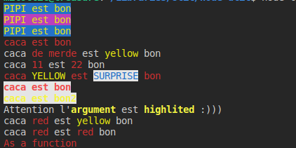

# @upradata/browser-util
Node Utilities

## A bunch of utilities in typescript working on Node (not on browsers)

- template string style function to stylish output on terminal
  
```
conconst { styles, Style, COLORS_SAFE } = require('../../dist');

const y = styles.yellow;

console.log(y.bgBlue.$`PIPI est bon`);
console.log(y.bgMagenta.$`PIPI est bon`);
console.log(y.bgBlue.$`PIPI est bon`);

console.log(styles.red.$`caca est bon`);

console.log(`caca ${styles.red.$`de merde`} est ${styles.yellow.$`yellow`} bon`);
console.log(styles.red.args.$`caca ${11} est ${22} bon`);
console.log(styles.red.$`caca ${styles.yellow.$`YELLOW`} est ${styles.blue.bgWhite.$`SURPRISE`} bon`);

const s = new Style();
const stylish = s.style([COLORS_SAFE.red, COLORS_SAFE.bold, COLORS_SAFE.bgWhite]).$;
console.log(stylish`caca est bon`);

console.log(styles.yellow.bold.bgWhite.$`caca est bon2`);

const highlightArgs = styles.bold.yellow.args.$;
console.log(highlightArgs`Attention l'${'argument'} est ${'highlited'} :)))`);

const caca = 'red';
const bon = 'yellow';
console.log(`caca ${styles.red.$`${caca}`} est ${styles.yellow.$`${bon}`} bon`);
const same = 'red';
console.log(styles.red.args.$`caca ${same} est ${same} bon`);


console.log(styles.red.$$('As a function'));
```

will render:




There is a list of predefined styles. Check [BasicStyleList](./src/style/basic-style-list).

You can set your own style function using styles as follow:

```
const s = new Style();
const stylish = s.style([COLORS_SAFE.red, COLORS_SAFE.bold, s => `Wow ${s} is beautiful`]).$;

console.log(stylish`Make me beautiful`);
```

You can call the template string function as a traditional function:

```
console.assert(styles.red.$$('Wowww') === styles.red.$`Wowww`);
```
